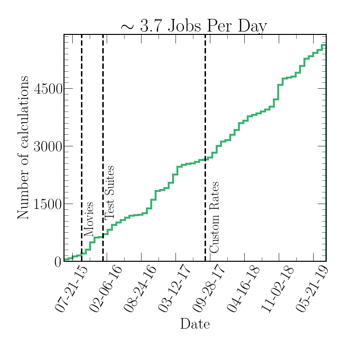

# Summary

A well written summary. 

# Statement of need 

A well written statement of need. 

# Examples


# Citations


# Figures

Figures can be included like this:

and referenced from text using \autoref{fig:example}.

Fenced code blocks are rendered with syntax highlighting:
```python
for n in range(10):
    yield f(n)
```	

# Acknowledgements

We acknowledge contributions from Brigitta Sipocz, Syrtis Major, and Semyeong
Oh, and support from Kathryn Johnston during the genesis of this project.

# References
